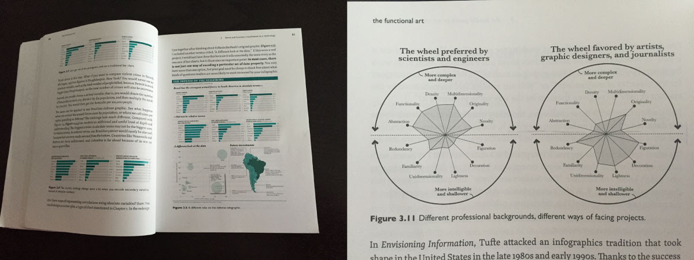
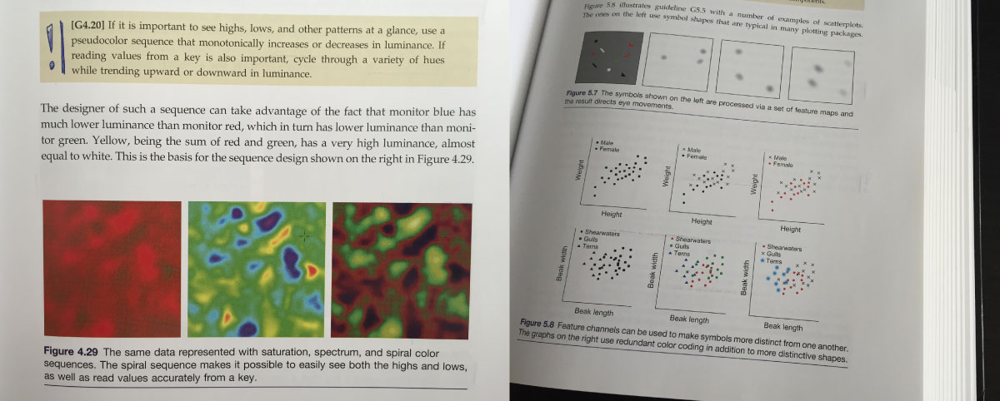
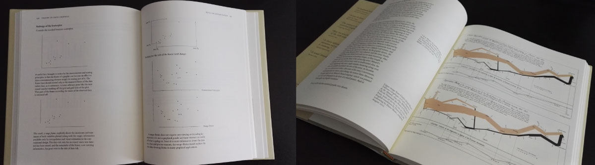
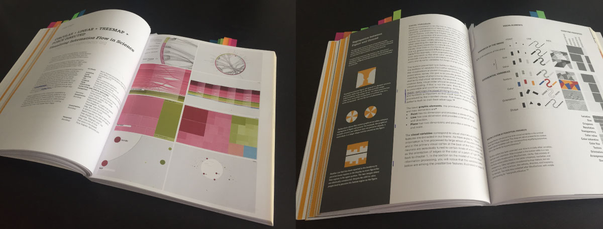

# Data visualisation - approaches and resources

## Books

The Functional Art, Alberto Cairo - great intro, foundations of how and why, interveiws with designers

Information Visualization, Colin Ware - textbook, detailed reference

The Visual Display of Quantitative Information, Edward Tufte - opinionated, great examples

Design for Information, Isabel Meirelles - source book, broad sweep of inspiration

## Static figures

- https://ggplot2.tidyverse.org/ - figures in R
- https://matplotlib.org/ - figures in Python
- https://seaborn.pydata.org/ - higher-level Python library, some useful and more complex figures

- https://mtennekes.github.io/tmap/articles/tmap-getstarted.html - maps in R (see also https://geocompr.robinlovelace.net/adv-map.html)
- https://scitools.org.uk/cartopy/docs/latest/ - maps in Python (see also https://geographicdata.science/book/notebooks/05_choropleth.html)

## Interactive web visualisations

- https://d3js.org/ - fairly low-level, very helpful for build-it-yourself custom
- https://vega.github.io/vega-lite/ - built on top of D3, compose 2D / interactive plots

- https://leafletjs.com/ - simple maps
- https://docs.mapbox.com/mapbox-gl-js/example/ - higher performance maps

## Galleries

- https://python-graph-gallery.com/
- https://www.r-graph-gallery.com/

## More resources

Community, discussion channels, resource lists
- https://www.datavisualizationsociety.com/

Books (with short reviews)
- https://www.visualcinnamon.com/resources/learning-data-visualization/books
