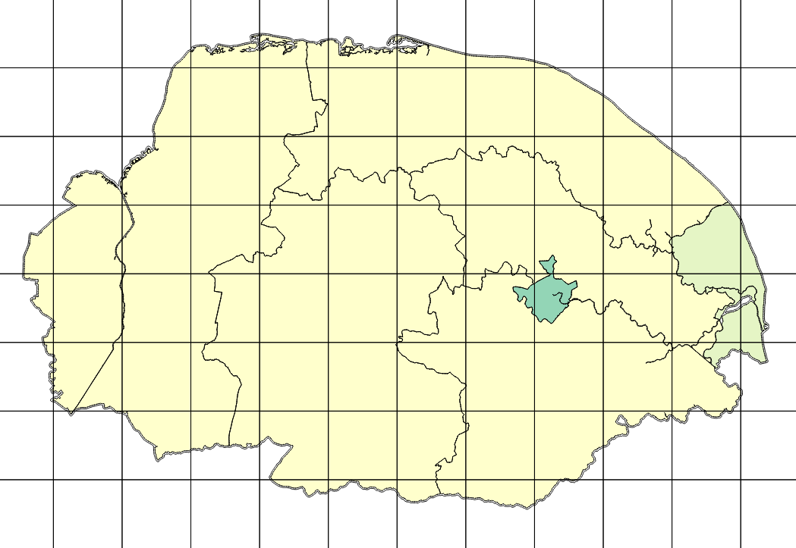

* TOC
{:toc}

## Introduction

The aim of this microsite is to provide advice and guidance for how to
prepare your model for the simulation modelling integration framework,
[smif](https://github.com/nismod/smif).
This page focusses on practical guidance to help you draw together
the various bits and pieces of data, information and configuration you will need.

For technical details on how to use `smif`, please read
the [documentation](http://smif.readthedocs.io/en/latest/) for the package.

If you have any questions, comments or suggestions please direct them via
e-mail or Slack to the Oxford integration team.

A data template is available to [download](../files/integration_template.xlsx).

## Audience

This document is intended for the following users:

### Data Provider

You collate, summarise and process raw data to produce scenarios of
future change, e.g. population, demographics and economic growth.

Please follow these guidelines:
1. [Download](../files/integration_template.xlsx) the template
1. [Metadata](./smif-prerequisites.html#metadata)
2. [Scenarios](./smif-prerequisites.html#scenarios)

### Sector Modeller

You develop and implement a simulation model of an infrastructure system.

Please follow these guidelines:
1. [Download](../files/integration_template.xlsx) the template
1. [Metadata](./smif-prerequisites.html#metadata)
1. [Sector Model config](./smif-prerequisites.html#configuration-sector-model)
2. [Interventions](./smif-prerequisites.html#interventions)
3. [Initial Conditions](./smif-prerequisites.html#initial-conditions)
5. [Initial System](./smif-prerequisites.html#initial-system)

### System Modeller

You use a system-of-systems model to analyse the evolution of coupled
infrastructure systems, interdependencies under different scenarios

Please follow these guidelines:
1. [Download](../files/integration_template.xlsx) the template
1. [Narratives](./smif-prerequisites.html#narratives)

## Packaging and Deployment

The simulation model should be packaged so that it is deployable on the target
machine.

## Wrapping the Model


import example from examples

python_codesnippet = here


### Error Handling

### Logs

#### Log Level

### Output

## Data Requirements

### Initial System

This section is for [modellers](./smif-prerequisites.html#sector-modeller).

These files hold a list of interventions for which the build date is before the
start year of the model time horizon. 
This enables `smif` to construct the initial systems in the simulation models
and users to view, visualise and edit the initial systems in the smif GUI.

| Attribute | Type | Example | Notes |
| --- | --- | --- | --- |
| intervention name | string | `sizewell_b` | Reference to the intervention name defined in the interventions file |
| build_year | integer | `1995` | The year in which the historical intervention was comissioned |

### Initial Conditions

This section is for [modellers](./smif-prerequisites.html#sector-modeller).

This data holds initialisation values of parameters which are otherwise 
dynamically determined by the model (also called 'state').

For example, the level of a reservoir in a water supply model may be passed
between planning years (an example of inter-seasonal or inter-year storage).
The initial value of the reservoir level can be set in this dataset.

| Attribute | Type | Example | Notes |
| --- | --- | --- | --- |
| parameter name | string | `reservoir_level` | Reference to the parameter name defined in the sector model parameters |
| initial value | float | `30294919.123`| The initial value of the paramter |

### Metadata

This section is for [modellers](./smif-prerequisites.html#sector-modeller) 
and [data providers](./smif-prerequisites.html#data-provider).

Anytime that data is specified, a reference to an interval, region (and units)
definition file must be associated with the data.
This allows `smif` to perform spatio-temporal conversion operations
on the data between models.

The region and interval definition files allow users to specify the way
in which space and time are divided in their data inputs and outputs.

#### Intervals

An interval definition specifies how the time within a year (8760 hours)
is divided into discrete intervals.

An example interval definition csv file::

```
id,start_hour,end_hour
1,PT0H,PT8760H
```

In the above example, id `1` is associated with the start hour 0 and
end hour 8760 - representing the entire year.
The [ISO8601](https://en.wikipedia.org/wiki/ISO_8601#Durations) standard 
is used to define intervals.

This interval id is used in data files to associate a data row with an interval.

#### Regions

Regions can be contained within a shape file or geojson formats,
anything which can be opened by `smif`.
A `name` field should exist in the region file and uniquely identify each region.



This region `name` is then used in data files to associate a data row with an area.

The values for `name` should be unique within the file.
Each shape should be either a polygon or multipolygon.
If a single region has disjoint parts, it should be stored as a multipolygon.

Note that all region definitions within a project should typically refer
to the same total area.
For example, the union of all the region shapes should correspond
to the same outline of the UK, within a UK project.

In addition, region definitions are loaded with the following attributes:

| Attribute | Type | Example | Notes |
| --- | --- | --- | --- |
| name | string | `lad` | A unique name for the region definition at project level |
| description | string | `Local authority districts for the UK` | |
| filename | string | `lad.shp` | |

#### Units

All SI unit definitions are supported by `smif` (although as of v0.5,
conversion between units is not yet implemented) and are parsed
into a normalised form. For example `MWh` becomes `megawatt_hour`.

In future versions of `smif`, a unit definition file will
allow the specification of conversion functions across units.
`smif` uses a Python package [Pint](http://pint.readthedocs.io/en/latest/index.html) to manage units.

Using Pint, new units and relations between units can be defined
in the following way:
```
hour = 60 * minute = h = hr
minute = 60 * second = min
```

### Interventions

This section is for [modellers](./smif-prerequisites.html#sector-modeller).

Interventions represent the lowest level targets of decisions within an
infrastructure simulation model.

To enable the decision module of `smif`, interventions must be defined for each
of the simulation models within a system-of-systems model.

Once defined, these interventions can be exposed to various pieces of functionality
within `smif`, including defining strategies and exploring decision space across
infrastructure system-of-systems.

| Attribute | Type | Example | Notes |
| --- | --- | --- | --- |
| name* | string | `nuclear_large_oxford` | Unique within a sector model |
| capital_cost_value* | float | `20.3` ||
| capital_cost_unit* | string | `£B` |
| economic_lifetime* | integer | `20` | The duration over which the capital cost is ammortized|
| operational_lifetime | integer | `25` | The duration during which the intervention is active |
| location* | string | `Oxford` | |
| capacity_value | float | `1000` | Example of a custom attribute |
| capacity_unit | string | `MW` | Example of a custom attribute |
| start_year | integer | `2018` | Example of a custom attribute |

*required information

### Narratives

This section is for [system modellers](./smif-prerequisites.html#system-modeller).

Narratives are the means by which packages of assumptions can be included in a
model run. Narratives cut across model parameters, simulation models,
and strategies, enabling complex combinations of user-defined functionality to
be included in a model run.

An example narratives file:

```
global:
  discount_rate: 0.05
energy_demand:
  assump_diff_floorarea_pp: 0.5
```

### Scenarios

This section is for [data providers](./smif-prerequisites.html#data-provider).

Below is an example scenarios file which shows the change in population
for three regions, England, Scotland and Wales for the years
2010, 2015 and 2020.
The polygons associated with the regions are stored in a region definitions
file.
The duration associated with the interval `1` are stored
in the interval definitions file.
See the [metadata](./smif-prerequisites.html#metadata) section for details on
how to define region and interval definitions if you have not already done so.

```
timestep,region,interval,value
2010,England,1,52000000
2010,Scotland,1,5100000
2010,Wales,1,2900000
2015,England,1,53000000
2015,Scotland,1,5300000
2015,Wales,1,3000000
2020,England,1,54000000
2020,Scotland,1,5500000
2020,Wales,1,3200000
```

| Attribute | Type | Example | Notes |
| --- | --- | --- | --- |
| timestep | integer | `2010` | A valid year integer |
| region | string | `England` | Reference to the names of the regions in the associated [region definition file](./smif-prerequisites.html#regions)|
| interval | string | `1` | Reference to  the id of the intervals in the associated [interval definition file](./smif-prerequisites.html#intervals)|
| value | float | `52000000` | Will normally be a floating point number |

## Configuration: Sector Model

This section is for [modellers](./smif-prerequisites.html#sector-modeller).

The following configuration data is required to integrate a sector model within
the smif framework:

* model name
* path to the wrapper
* name of the wrapper class
* inputs
* outputs
* parameters
* interventions

| Attribute | Type | Example | Notes |
| --- | --- | --- | --- |
| model name | string | `energy_demand` | A unique name
| path | string | `../../models/energy_demand/run.py` | Relative to the project folder |
| classname | string | `EnergyDemandWrapper` | Name of the python class in the wrapper file |
| inputs | list | [see below](./smif-prerequisites.html#inputs-and-outputs) | |
| outputs | list | [see below](./smif-prerequisites.html#inputs-and-outputs) | |
| parameters | list | [see below](./smif-prerequisites.html#parameters) | |
| interventions | string | `energy_demand.yml` | Name of the interventions file in the `project/data/interventions` folder |
| initial conditions | string | `energy_demand_existing.yml` | Name of the file in the `project/data/initial_conditions` folder |

### Inputs and Outputs

`smif` requires all model inputs and outputs to be explicitly defined
so that data can be passed to and retrieved from a model at runtime.

Wherever you have a data passed into your model from another source, you should
define an input.
For each of the results you model produces, you need to define an output.
For example, a digital communications model may require `population` data as an
input, and produce a `service quality` metric and 
an `fibre-optic repeater electricity demand` as an output

| Attribute | Type | Example | Notes |
| --- | --- | --- | --- |
| name | string | `population_density` | Unique to inputs or outputs |
| spatial_resolution | string | `lad` | Reference to the name of a region definition |
| temporal_resolution | string | `annual` | Reference to the name of an interval definition |
| units | string | `people/km^2`| SI units are automatically parsed, otherwise a warning is raised |

The dependency upon another data source are explicitly declared in the
integration framework.
To declare a dependency, both models must have the requisite inputs
and outputs defined.
For example, if you wish to couple your energy demand model
with an energy supply model, you will need to define outputs
for `electricity demand`, `natural gas demand`, `hydrogen demand` and so on.
The energy supply model would then need to define inputs for `electricity`,
`natural gas` and `hydrogen`.
Note that the names should be unique within a sector model and list of
inputs and outputs.
It is helpful if the names are easy to understand or descriptive.

### Parameters

Parameters are the means by which the 'dials and knobs' of a model can be made
visible to `smif`. Once defined, parameters can be modified through the smif GUI
or connected to narratives.

Initially, (as of `smif v0.5`) only floating point parameters are supported,
but future versions will support categorical and boolean parameters.

| Attribute | Type | Example | Notes |
| --- | --- | --- | --- |
| name | string | `assump_diff_floorarea_pp`| |
| description | string | `Difference in floor area per person in end year compared to base year` | |
| absolute_range | tuple | (0.5, 2) | |
| suggested_range | tuple | (0.5, 2) | |
| default_value | float | 1 | |
| units | string | `percentage` | |